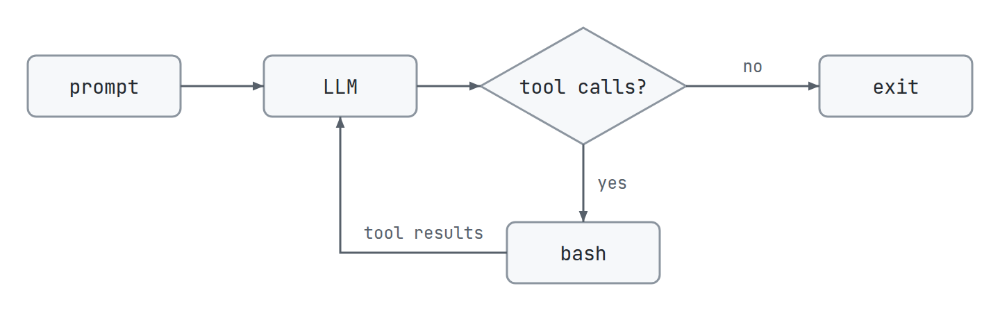
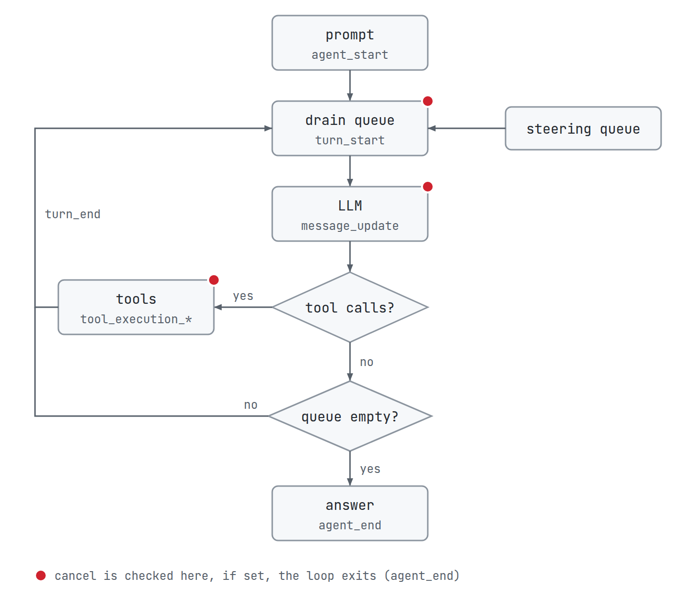
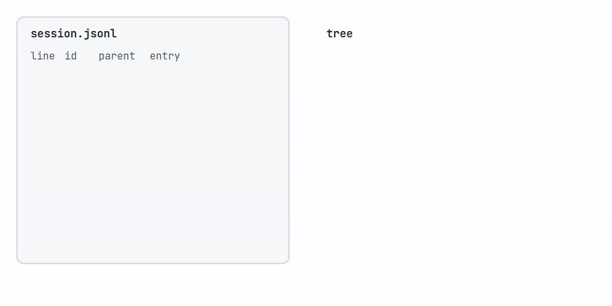
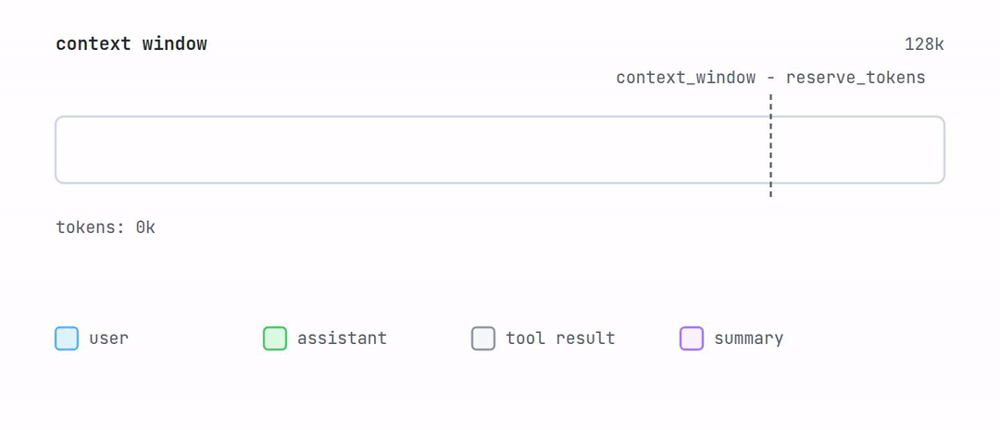
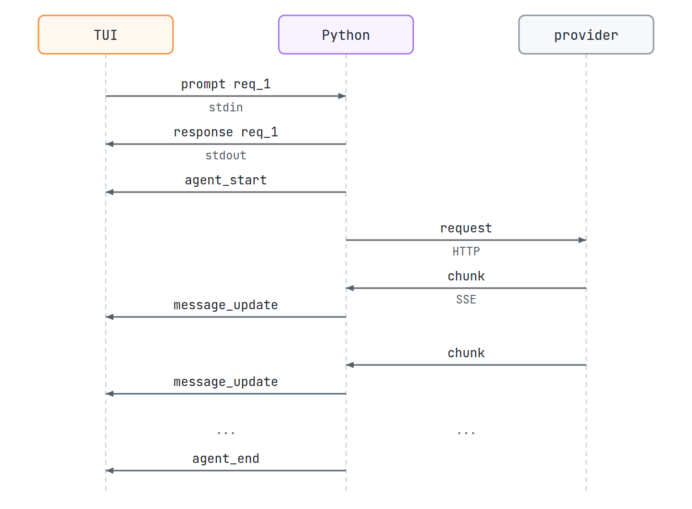
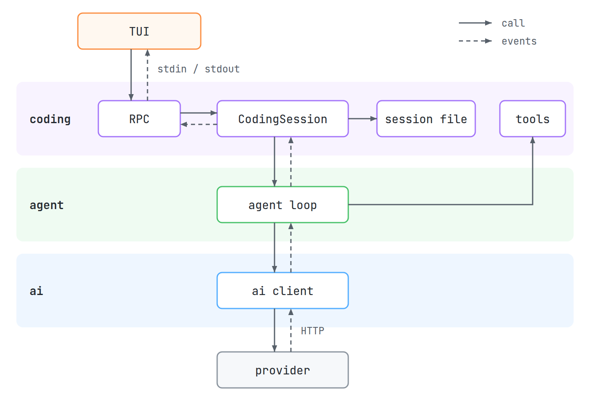

# Building a coding agent from scratch

Source code: [nik-55/mini-pi](https://github.com/nik-55/mini-pi)<br>
PyPI: [mini-pi-agent](https://pypi.org/project/mini-pi-agent/)

<iframe src="https://www.youtube.com/embed/14buip8OnWM" title="Building a coding agent from scratch" style="display:block;width:100%;aspect-ratio:16/9;border:0" loading="lazy" allow="accelerometer; clipboard-write; encrypted-media; gyroscope; picture-in-picture" referrerpolicy="strict-origin-when-cross-origin" allowfullscreen></iframe>

*I asked an LLM to make a video after writing this blog post. It explains the concepts neatly.*

I have been building my own coding agent from scratch recently, and I want to write about it. The design is heavily inspired by [pi](https://github.com/earendil-works/pi). Since my agent is a lightweight version of it, I called it `minipi`. I wrote it in Python for readability, but the blog stays language agnostic. In this post, I will walk through the concepts I learned while building it.


## An Agent with no batteries

An agent is an LLM calling tools in a loop. This is the ReAct pattern (reason + act + observe). The model reasons over the conversation, and if it calls a tool, we run the tool and send the result back. It observes the result, and this repeats until it replies without calling any tool.

```python
agent(prompt, tools):
    history = [prompt]

    while True:
        assistant = llm(history, tools)
        history.append(assistant)

        if assistant has no tool calls:
            break

        for call in assistant.tool_calls:
            result = run(call)
            history.append(result)
```



We can pass `tools = [bash]`, which runs the commands the model sends, and congrats, we are done. We just built a coding agent :)

But would you actually use this in your day-to-day work? Probably not. It needs a lot of plumbing before we can use it the way we use other agents, and this blog is mostly about that plumbing. The missing pieces:
- It is tied to one provider's API.
- We can't stop it midway.
- Bash can run commands outside the project directory.
- It forgets everything when it exits.
- Long sessions fill the context window.
- You can't add anything without changing its core code.
- There is no surface to talk to it.

The rest of the blog fixes these one by one.

## Talking to the Model

There are a lot of inference providers, and each provider supports many models. The API surface varies by both provider and model, so we should not couple our code to any specific provider. For this, *we can use the ports and adapters pattern*. We define a standard interface (the port, e.g. `AssistantMessage`) that the rest of our application uses. The adapter then does two things: *it transforms objects from the port into provider-specific objects, and when the provider responds, it transforms the response back to the port*. The following is our port:

```python
UserMessage:
    role = "user"
    content: str

ToolCall:
    id: str
    name: str
    arguments: dict[str, Any]

StopReason = "stop" | "length" | "tool_use" | "error" | "aborted"

AssistantMessage:
    role = "assistant"
    content: str = ""
    tool_calls: list[ToolCall] = []
    thinking: str = ""
    stop_reason: StopReason | None = None
    error_message: str | None = None

ToolResultMessage:
    role = "tool_result"
    tool_call_id: str
    tool_name: str
    content: str
    is_error: bool = False
```

When a request to the provider fails with a retryable error (like a timeout or a rate limit), it retries after a delay. The retry respects headers like `retry-after` if the provider sends them.

### Parsing the Stream

The provider streams its response as server-sent events (SSE): content, thinking and tool call arguments arrive in small pieces across many chunks. The adapter collects them and builds one `AssistantMessage` at the end. The following pseudo-code is specific to [OpenAI Chat Completions](https://developers.openai.com/api/reference/resources/chat/subresources/completions/streaming-events).

```python
Parser:
    content, thinking = "", ""
    tool_calls = {}              # index -> {id, name, arguments_parts: list[str]}
    finish_reason, usage = None, None

    feed(chunk):
        if chunk has usage: set usage    # the last chunk carries the usage
        if chunk has finish_reason: set finish_reason
        content += chunk.content
        thinking += chunk.thinking
        for delta in chunk.tool_calls:
            call = tool_calls[delta.index]    # new entry if the index is new
            set call.id and call.name if the delta has them
            call.arguments_parts.append(delta.arguments)

    finalize():
        calls = [ToolCall(c.id, c.name, parse_json(join(c.arguments_parts))) for c in tool_calls]
        return AssistantMessage(content, thinking, calls, finish_reason, usage)

parser = Parser()
for chunk in stream:
    parser.feed(chunk)

assistant_message = parser.finalize()
```

## Agent Loop

Multiple checkpoints occur in the ReAct loop (e.g. tool execution started, tool execution completed, LLM is thinking), and we want to inform the end consumer about those states as they happen. How would you build it?

> *By consumer, I mean a surface for interacting with the coding agent, for example the Claude Code CLI or the VS Code extension. There can be multiple types of consumers, like a TUI, a normal REPL, JSON-RPC, or even an API server.*

So we don't want to tie the loop's code to any one consumer. Instead, we can use *pub-sub: the loop publishes events at different checkpoints, and any interested consumer can subscribe to them*. When an event arrives, the consumer parses it and acts accordingly.

Suppose the user sends the prompt "Read file foo.py and explain it". Here are the events:

```text
agent_start                  agent loop begins
  message_start              UserMessage ("Read file foo.py ...") starts
  message_end                UserMessage ends
  turn_start                 turn 1 begins, prompt is sent to the LLM
    message_start            AssistantMessage starts
    message_update           LLM is streaming tokens (content or thinking deltas)
    message_end              full AssistantMessage containing tool calls
    tool_execution_start     tool starts executing
    tool_execution_end       tool finishes executing
    message_start            ToolResultMessage starts
    message_end              ToolResultMessage ends
  turn_end                   turn 1 ends
  turn_start                 turn 2 begins, tool result and message history are fed to the LLM
    message_start            AssistantMessage starts
    message_update           LLM is streaming tokens
    message_end              full AssistantMessage, no tool calls
  turn_end                   turn 2 ends
agent_end                    no queued messages, agent loop ends
```

The following pseudo-code describes the full loop, including these events. The loop takes the user prompt and the message history so far as input. The user can also send a message while the agent is working to steer it in a particular direction. Steering messages are appended to a queue, and the loop adds them to the history at the start of the next turn.

```python
# Before each return, the loop still yields the _end events for what it started
# (e.g. turn_end, agent_end). They are skipped below for simplicity.

# final_system_prompt = system_prompt + AGENTS.md + frontmatter(.agents/skills/*/SKILL.md)

agent_loop(prompt, history, tools):
    yield agent_start
    history.append(prompt)

    is_assistant_done = False
    while not is_assistant_done or steering_queue is not empty:
        yield turn_start
        if user cancelled: return

        for message in steering_queue.drain():
            history.append(message)

        for delta in llm.stream(history, tools):
            if user cancelled: return
            yield message_update(delta)

        assistant = full message built from the stream
        history.append(assistant)
        yield message_event(assistant)

        if assistant.stop_reason in ("error", "aborted"): return

        for call in assistant.tool_calls:
            if user cancelled: return
            yield tool_execution_start(call)
            if assistant.stop_reason == "length":
                result = error("arguments may be cut off, send the tool call again")
            else:
                result = execute(call) after validating its arguments
            history.append(result)
            yield tool_execution_end(result)

        is_assistant_done = len(assistant.tool_calls) == 0
        yield turn_end

    yield agent_end
```



Providers expect the message history to have valid pairs: if the assistant calls tools, every tool call must be followed by its result. So if a tool call is aborted or fails, we still add a `ToolResultMessage` with the error message as content. If an assistant message errored, we skip that message, so for the model it is as if it never happened.

### Blocking vs Async

Our agent is single-threaded, so there is one gotcha we need to handle carefully. Suppose the user sends the message "hi", and the request goes to the LLM. The request is an I/O call, so with a blocking implementation, the agent pauses until the LLM response completes. What is the consequence? While the LLM is responding, the agent is busy waiting for and streaming the response, and it does not read any new requests from the user. So a request to abort, or even a steering message, is not handled until the response ends. That is why we need an asynchronous implementation, where the event loop is not blocked and can receive new requests as they come. (Don't confuse async with multithreading or multiprocessing.)

## Tools

What tools does a coding agent need at minimum? Check out [mini-swe-agent](https://github.com/swe-agent/mini-swe-agent): it gives the agent only one tool, `bash`, and that works. However, we can use different AI models, and not all of them are good at editing files through `bash`; indentation and escaping errors are common. Also, reverting file changes on rewind is possible for edits made with the file tools. For changes made through commands, it can be tricky to know which files to revert. So we add three more tools: `read`, `write` and `edit`. Separate tools also help if we later want a planning mode, where the agent can only read files (and maybe grep) to explore.

- `read(path, offset?, limit?)`: It reads up to `limit` lines starting at line `offset` (1-indexed), and truncates the output (`output[:max 50KB]`). 50 KB is approximately 14K tokens.
- `write(path, content)`: It creates the file if it doesn't exist, and overwrites it if it does.
- `edit(path, old_string, new_string)`: It replaces `old_string` with `new_string` only if `old_string` occurs exactly once in the file.

### Bash

- `bash(command, timeout?)`: It runs the command, with a default timeout of 60 seconds. Both `stdout` and `stderr` go to the same pipe, so we get the log in roughly the order it was written. Since logs contain the critical details at the end, we keep the tail rather than the head (`output[-max 50KB:]`).
- How do we implement bash? We start bash as a subprocess. But then, how does the cancellation signal kill it? We are in an event loop, so we can't sit in a while loop waiting for either the cancellation or the process to finish; that would block the event loop.
- Instead, we race two concurrent tasks: one waits for the cancellation signal, and the other reads the process's output pipe. If the cancellation task finishes first, we kill the process.
- One more gotcha: the command can start more processes of its own, and killing bash does not kill them. So we start bash in its own process group (every process it starts joins the same group) and kill the entire group instead.

```python
bash(command, timeout = 60):
    process = start "bash -c <command>" as a subprocess in a new process group,
              with stdout and stderr going to the same pipe

    output_task = task that reads the pipe until the process exits
    cancel_task = task that waits for the cancellation signal

    first = race(output_task, cancel_task, timeout)

    if first is output_task:
        return output_task.result[-max 50KB:]

    kill the entire process group
    if first is cancel_task: return error("command cancelled by user")
    else: return error("command timed out after <timeout> seconds")
```

### Sandbox

We also need a sandbox. The `read`, `write` and `edit` tools accept only file paths inside the current working directory and reject anything outside it. For bash, I use bubblewrap, which relies on Linux namespaces to limit what the command can do. For example, if the sandbox mounts a directory as read-only, the kernel itself rejects any write to that directory, so a command can't get around it. If bubblewrap is not installed, the agent falls back to `ask` mode, where the user is prompted every time before a command runs.

### Operations

All the tools above interact with the filesystem and the shell: they read and write files and run commands. Let's call these operations. If the tools call the local operations directly, they can only run on the machine where the coding agent is installed. But sometimes you want to run the coding agent locally while its operations run on a remote server over SSH. So instead, we define an interface with the operations each tool needs.

```python
ReadOperations:
    read_text: Callable[[str], str]
    access: Callable[[str], None]            # check that the file is accessible and readable (raise an error if not)
    resolve_path: Callable[[str, str], str]  # resolve the path relative to the workspace (raise an error if it is outside)
```

The local implementation is built in. For another system, like a remote server over SSH, you implement the same interface and nothing else needs to change.

## Sessions

At certain checkpoints, for example when an assistant message is completed, we want to save it to disk. Can we use JSON? An agent works over many turns, and rewriting the entire JSON file at every checkpoint is not efficient. Instead, we can use JSONL, where each line is one entry, so at each checkpoint we just append a new line. This makes our storage append-only: we never remove or modify older entries, and each checkpoint adds a new entry.

```python
BaseEntry:
    type: SessionType
    id: str
    timestamp: str
    parent_id: str | None = None

SessionHeader(BaseEntry):
    type = "header"
    cwd: str

MessageEntry(BaseEntry):
    type = "message"
    message: Message

CompactionEntry(BaseEntry):
    type = "compaction"
    summary: str
    first_kept_entry_id: str
```

The session file is created only after the first successful assistant message; creating it earlier would leave useless files for sessions that never got a response.

### Traversal

Each entry in the JSONL file stores the id of its parent in `parent_id`. To read a session, we take the last entry, move to its parent via `parent_id`, and keep going until `parent_id` is `None`. This walk gives the entries from newest to oldest, reversing it gives them in order, which we turn into messages.

This design also makes branching easy. We keep a pointer in memory, `leaf_id`, to the last entry of the current branch. To rewind, we move `leaf_id` to the entry we want to go back to. When the next message arrives, we append it with `leaf_id` as its parent, so a single flat file holds multiple branches. It is a similar idea to how git stores commits.

```text
line  id   parent_id  entry
1     s1   None       header
2     e1   None       user: "Read foo.py"
3     e2   e1         assistant: calls read("foo.py")
4     e3   e2         tool result: contents of foo.py
5     e4   e3         assistant: "foo.py parses the config"
6     e5   e4         user: "Now add tests for it"
7     e6   e5         assistant: "Added tests"

Rewind to e4 (leaf_id = e4), then the user sends a new message:

8     e7   e4         user: "Explain bar.py instead"
9     e8   e7         assistant: "bar.py starts the server"

leaf_id = e8
walk:     e8 -> e7 -> e4 -> e3 -> e2 -> e1 -> None
reversed: e1, e2, e3, e4, e7, e8

e1 - e2 - e3 - e4 -+- e5 - e6    old branch, still in the file
                   +- e7 - e8    active branch
```



## Compaction

Coding agents run over many turns and call many tools, which fills the context window. Compaction replaces the older messages with a summary. The user can trigger it manually, or it runs automatically: we estimate the number of tokens (from the usage the provider reports, or a simple character count), and if there is not much space left in the context window, we compact.

When compacting, we want to keep the recent turns so the agent knows what it is doing right now. How many tokens to keep is set by `keep_recent_tokens`. So we need a cut point: the message before which everything is summarized, chosen so the messages after it fill the `keep_recent_tokens` budget. After compaction, the summary becomes a `UserMessage`, and a `UserMessage` can't be followed by a `ToolResultMessage`, so we can't cut at a tool result. Assistant and user messages are both valid cut points.



There are different ways to generate the summary. What I implemented is a separate request to the LLM: the system prompt explains how to write the summary, the message history is sent as one string, and the LLM writes the summary. The downside is a cache miss, since the entire history goes out as a new request.

My guess is that Claude Code and Codex do it differently: they add the compaction prompt to the same conversation, so the cached history is reused. They run thousands of compactions at any moment, and if each one were a cache miss over such long conversations, it would be hard to scale.

The compaction prompt also needs tuning. A bad summary makes the agent forget what it did, what it was doing, and which approaches it already tried. The agent then explores the same things again until the context fills up and compacts again, and it can end up in a loop.

## Extensions

We also want users to extend the agent beyond what is built in, like extensions in VS Code. So we provide an API that defines which parts of the app can be extended and how.

```python
ExtensionAPI:
    def register_tool(tool: AgentTool) -> None
    def register_command(name: str, description: str, handler: Function) -> None
    def register_llm_provider(provider: Provider) -> None
    def on(event: str)
```

Extensions can also hook into the loop at specific points, look at the state, and act on it. For example, a hook on `agent_end` can send you an OS notification when the agent finishes (`notify-send` on Ubuntu). Or a hook can pause before a bash command and wait for the user to confirm whether to run it.

## TUI

Which surface should the user get (TUI, web, or an editor extension)? I prefer a TUI, and for simplicity, one surface is enough. Tokens stream fast, so we need a library that re-renders quickly without flickering. I tried some Python libraries but did not find them reliable enough. Pi ships its own TUI as a separate package, [`@earendil-works/pi-tui`](https://github.com/earendil-works/pi/tree/main/packages/tui). It is like React for the terminal: you build the UI from components, it redraws only the lines that changed (differential rendering), and it even renders markdown. But my code is in Python, and pi-tui is in TypeScript. How will they communicate?

VS Code is written in TypeScript, so how can it show lint errors in Python? It uses the Language Server Protocol (LSP): VS Code spawns the language server as a separate process, and the two talk over stdin/stdout (much like MCP), using JSON-RPC messages.

We can do the same, with a protocol similar to JSON-RPC. The TUI spawns Python as a subprocess, and on the Python side we implement an RPC server that reads requests from the TUI on stdin and writes responses to stdout. Think of it as a backend and a frontend with a two-way channel between them.

Why not a web server? Because any other local process can connect to it, and there can be port conflicts. With a subprocess, we can also tell the kernel to kill Python if the TUI is killed, so no stale process is left. The following example shows what stdin/stdout look like.

<details markdown="1">
<summary>stdin/stdout for the prompt "hi"</summary>

```text
▶ python3 -m coding.main --mode rpc
{"type": "prompt", "message": "hi", "id": "req_1"}
{"id": "req_1", "type": "response", "request_type": "prompt", "success": true}
{"type": "agent_start"}
{"type": "message_start", "message": {"role": "user", "content": "hi"}}
{"type": "message_end", "message": {"role": "user", "content": "hi"}}
{"type": "turn_start"}
{"type": "message_start", "message": {"role": "assistant", "content": "", "tool_calls": [], "thinking": "", "thinking_signature": null, "stop_reason": null, "error_message": null, "usage": null}}
{"type": "message_update", "assistant_message_event": {"type": "thinking_delta", "delta": "The"}}
{"type": "message_update", "assistant_message_event": {"type": "thinking_delta", "delta": " user"}}
{"type": "message_update", "assistant_message_event": {"type": "thinking_delta", "delta": " just"}}
...llm thinking...
{"type": "message_update", "assistant_message_event": {"type": "text_delta", "delta": "Hi"}}
{"type": "message_update", "assistant_message_event": {"type": "text_delta", "delta": "!"}}
{"type": "message_update", "assistant_message_event": {"type": "text_delta", "delta": " I'm"}}
{"type": "message_update", "assistant_message_event": {"type": "text_delta", "delta": " mini"}}
...llm response...
{"type": "message_end", "message": ...}
{"type": "turn_end", "message": ...}
{"type": "agent_end", "messages": ...}
```

</details>

Each request is a JSON line on stdin with a request id. The backend parses it, takes the action, and writes the response to stdout with the same id, which is how the TUI matches a response to its request (`req_1` above).



The channel works in the other direction too. Sometimes Python needs an answer from the user, for example when the permission hook asks whether to run a bash command. Python then sends a request to the TUI with its own id and waits. The TUI shows the options, and when the user picks one, it replies with the same id:

```text
{"type": "extension_ui_request", "id": "a1b2c3", "payload": {"method": "select", "title": "Execute bash command\nrm -rf build", "options": ["Yes", "No"]}}
{"type": "extension_ui_response", "id": "a1b2c3", "value": "Yes"}
```

At a high level, the TUI has the following components:

```text
+-----------------------------------------------------------+
| Header                                                    |
|  +-------------+  +-------------------------------------+ |
|  |             |  | Mini-Pi <version>                   | |
|  |    logo     |  | model: <current model>              | |
|  |             |  | ~/path/to/cwd                       | |
|  +-------------+  +-------------------------------------+ |
+-----------------------------------------------------------+
| Conversation                                              |
|   messages, errors and notifications appear here          |
|                                                           |
+-----------------------------------------------------------+
| Editor                                                    |
|   where the user types a message to send                  |
+-----------------------------------------------------------+
```

The TUI is a subscriber to the events from the Agent Loop section. On `agent_start`, it shows a "working..." indicator. Each `message_update` appends the thinking or text delta to the conversation, so the work shows up as it streams. `tool_execution_start` shows the tool call with its arguments, and `tool_execution_end` shows the result (or the error). On `agent_end`, the indicator stops.

## Layers

Looking back, one more thing I took from pi is separation of concerns. Everything above falls into three layers: `ai`, `agent`, and `coding`. `ai` is the bottom layer; it only knows how to talk to providers and validate tool arguments. It should not care whether it is used to build an agent or just a normal chat application. `agent` implements the ReAct loop, calls the tools, handles errors, and publishes events at checkpoints to consumers. It should not care what kind of agent it is used to build, whether a coding agent or a trading agent. The `coding` layer holds everything specific to a coding agent: session storage, extension loading, the tools, and the RPC backend.



## Putting it together

Using the pieces above, you can build your own coding agent without any agentic framework :) For implementation details, checkout `minipi` repo.

### What we skipped?

- Providers: more built-in vendor APIs, more ways to auth, thinking levels
- Agent: system prompt, more hooks, built-in MCP, memory, parallel and background tool execution, better sandboxing.
- Sessions: `/fork`, session export
- TUI: auto completion, a better way to configure providers and settings, current context usage, cost
- Tests, evaluations and benchmark against other harnesses.
- Tons of more things...

### Conclusion

Hope you enjoyed reading it. It did get a bit lengthy though.

Also, here is weird logo ;) for cover image


Happy Hacking!
